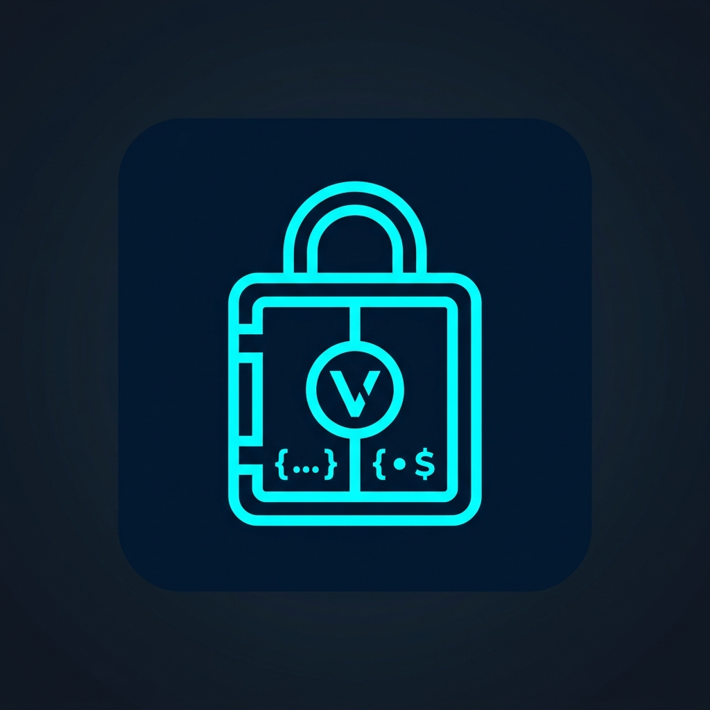

<p align="center">
  
</p>

<h1 align="center">🔐 EnvVault</h1>

---

## 🎯 One-Line Pitch

> **Encrypt your `.env` files in the browser — no server, no leaks, no trust required.**

---

## 📋 Project Description

EnvVault is a free, open-source web tool that lets developers safely encrypt and share their `.env` files using military-grade cryptography — entirely inside the browser. Paste your environment variables, set a password, and download a self-contained `.envvault` file. Anyone with the password and the file can decrypt it back to the original `.env` — no accounts, no cloud storage, no backend.

Under the hood, EnvVault uses **PBKDF2** (250,000 iterations, SHA-256) for key derivation and **AES-256-GCM** for authenticated encryption, powered by the browser's native **Web Crypto API**. All cryptographic parameters (salt, IV, algorithm, iterations) are embedded in the vault file itself, making it fully self-describing and future-proof.

Built for developers who work with secret tokens, database URLs, API keys, and other sensitive environment config that should never be sent over Slack or stored in plain text.

---

## 🏷️ Project Type

**Open Source Developer Tool** — a client-side security utility for software engineers and teams.

---

## 🖼️ Logo

<p align="center">
  
</p>

---

## 🌍 Markets

| # | Market | Relevance |
|---|--------|-----------|
| 1 | **Developer Tools** | Core audience — engineers who handle `.env` files daily |
| 2 | **Cybersecurity** | Password-based encryption for secrets management |
| 3 | **DevOps & Infrastructure** | Securely transferring env configs across environments |
| 4 | **Open Source** | MIT-licensed, community-auditable, zero lock-in |
| 5 | **SaaS & Startups** | Teams needing lightweight secret-sharing without paid tooling |

---

## ✨ Features

- 🔒 **Encrypt** any `.env` content with a password → downloads a `.envvault` file
- 🔓 **Decrypt** a `.envvault` file with the correct password → view or download the original `.env`
- 🛡️ **100% client-side** — all crypto runs in the browser using the native Web Crypto API
- 📦 Self-contained vault format with cryptographic parameters embedded in the file
- ⚡ Zero dependencies on any external API or cloud service

---

## 🚀 Getting Started

### Prerequisites

- [Node.js](https://nodejs.org/) ≥ 18
- [pnpm](https://pnpm.io/) (recommended) or npm

### Install & Run

```bash
# Install dependencies
pnpm install

# Start the dev server
pnpm dev
```

Open [http://localhost:5173](http://localhost:5173) in your browser.

### Build for Production

```bash
pnpm build
pnpm preview
```

---

## 🔑 How It Works

### Encryption

1. You paste your `.env` content and enter a password.
2. A random **16-byte salt** and **12-byte IV** are generated using `crypto.getRandomValues`.
3. The password is stretched into a **256-bit AES-GCM key** via **PBKDF2** (SHA-256, 250,000 iterations).
4. The env text is encrypted with **AES-GCM**.
5. A structured `.envvault` JSON file is downloaded containing all crypto parameters and the ciphertext.

### Decryption

1. You upload a `.envvault` file and enter the password.
2. The salt, IV, and ciphertext are read from the file.
3. The key is re-derived using the same PBKDF2 parameters embedded in the file.
4. The ciphertext is decrypted with AES-GCM and displayed in plaintext.
5. You can download the result as a `.env` file.

---

## 🗂️ File Format — `.envvault`

The encrypted output is a JSON file with the following schema (`EnvVaultFileV1`):

```json
{
  "format": "env-vault",
  "version": 1,
  "crypto": {
    "kdf": "PBKDF2",
    "hash": "SHA-256",
    "iterations": 250000,
    "salt": "<base64>"
  },
  "cipher": {
    "algorithm": "AES-GCM",
    "keyLength": 256,
    "iv": "<base64>"
  },
  "payload": {
    "ciphertext": "<base64>"
  },
  "meta": {
    "createdAt": "2026-09-07T08:00:00.000Z",
    "filename": ".env",
    "lineCount": 4
  }
}
```

All binary values (salt, IV, ciphertext) are **Base64-encoded**.

---

## 🔐 Cryptographic Parameters

| Parameter   | Value        |
|-------------|--------------|
| KDF         | PBKDF2       |
| Hash        | SHA-256      |
| Iterations  | 250,000      |
| Salt length | 16 bytes     |
| Cipher      | AES-GCM      |
| Key length  | 256 bits     |
| IV length   | 12 bytes     |

---

## 🗺️ Project Structure

```
vault/
├── src/
│   ├── App.tsx                  # Root component with routing
│   ├── main.tsx                 # React entry point
│   ├── components/
│   │   └── Nav.tsx              # Top navigation bar
│   ├── pages/
│   │   ├── EncryptPage.tsx      # Encrypt UI — paste .env → download .envvault
│   │   └── DecryptPage.tsx      # Decrypt UI — upload .envvault → view/download .env
│   └── crypto/
│       ├── constants.ts         # Crypto algorithm constants
│       ├── types.ts             # TypeScript type for the .envvault file schema
│       ├── deriveKey.ts         # PBKDF2 key derivation via Web Crypto API
│       ├── encryptEnv.ts        # Encrypt plaintext env → EnvVaultFileV1
│       ├── decryptEnv.ts        # Decrypt EnvVaultFileV1 → plaintext env
│       └── testCrypto.ts        # Manual round-trip test (encrypt → decrypt)
├── public/
│   └── logo.jpg                 # Project logo
├── index.html
├── vite.config.ts
├── tsconfig.json
└── package.json
```

---

## 🧰 Tech Stack

| Tool              | Purpose                        |
|-------------------|--------------------------------|
| React 19          | UI framework                   |
| TypeScript        | Type safety                    |
| React Router v7   | Client-side routing            |
| Tailwind CSS v4   | Styling                        |
| Vite 7            | Build tool & dev server        |
| Web Crypto API    | Native browser cryptography    |

---

## 🛡️ Security Notes

- **Zero server involvement** — encryption and decryption happen entirely in your browser.
- **PBKDF2 with 250,000 iterations** makes brute-force attacks significantly slower.
- **AES-256-GCM** provides both confidentiality and integrity (authenticated encryption).
- A fresh **random salt and IV** are generated on every encryption, so encrypting the same file twice produces different ciphertext.
- The vault file contains no plaintext copy of your password — only the derived key material is used.

> ⚠️ If you lose your password, there is **no recovery mechanism**. The ciphertext is unrecoverable without it.

---

## 📄 License

MIT
